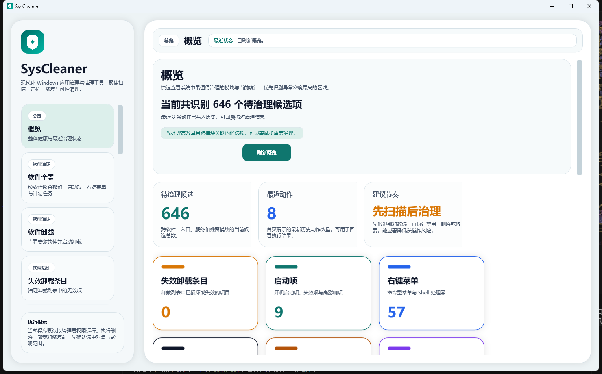

# SysCleaner


SysCleaner is a Windows cleanup utility built with .NET 8 and WPF. It focuses on explainable, app-centric cleanup workflows instead of aggressive one-click deletion.

The project is designed around one core principle: preview first, execute second, and keep cleanup actions attributable.

## Highlights

- Installed application discovery with normalized metadata
- Broken uninstall-entry detection and cleanup
- Residual file, registry, startup item, context menu, scheduled task, and service analysis
- File lock detection and unlock assistance
- Empty file and empty folder cleanup with controlled scope
- Operation logging and recovery-oriented execution flow
- System repair and Windows Update repair/diagnostics entry points

## Preview

Main window snapshot from the current WPF build:



UI views already implemented in the WPF client include:

- Dashboard
- Installed apps
- Residue cleanup
- Registry cleanup and registry search
- Context menu cleanup
- Startup items
- Scheduled tasks
- System services
- Unlock assistant
- System repair
- Windows Update repair
- History

## Getting Started

### Requirements

- Windows 10 or Windows 11
- .NET 8 SDK
- Visual Studio 2022 or newer with WPF/Desktop development workload

### Build

```powershell
dotnet build SysCleaner.slnx
```

### Test

```powershell
dotnet test SysCleaner.slnx
```

### Run

```powershell
dotnet run --project src/SysCleaner.Wpf/SysCleaner.Wpf.csproj
```

The WPF app is configured to request administrator privileges through its manifest because several cleanup and diagnostic operations require elevation.

## Release And Publish

### Build Release binaries

```powershell
dotnet build SysCleaner.slnx -c Release
```

### Publish a framework-dependent package

```powershell
dotnet publish src/SysCleaner.Wpf/SysCleaner.Wpf.csproj -c Release -r win-x64 --self-contained false
```

Typical output directory:

```text
src/SysCleaner.Wpf/bin/Release/net8.0-windows/win-x64/publish/
```

### Publish a self-contained package

```powershell
dotnet publish src/SysCleaner.Wpf/SysCleaner.Wpf.csproj -c Release -r win-x64 --self-contained true
```

### Packaging notes

- The application currently publishes as a standard WPF executable layout.
- The app manifest requests administrator privileges at startup.
- A dedicated MSIX or installer project is not currently configured in this repository snapshot.
- For internal distribution, the publish output can be zipped and distributed directly.

## Usage Flow

1. Open the app and choose a cleanup module from the left navigation.
2. Run a scan for the selected scope.
3. Review evidence, risk hints, and matched items before executing changes.
4. Select only the items you want to process.
5. Execute cleanup or repair actions.
6. Review history and logs to audit what changed.

## Solution Structure

```text
src/
  SysCleaner.Wpf/             WPF shell, views, themes, and view models
  SysCleaner.Application/     Application services and orchestration
  SysCleaner.Domain/          Core domain models, enums, rules, and diagnostics
  SysCleaner.Infrastructure/  Windows integration, persistence, cleanup services
  SysCleaner.Contracts/       Cross-layer interfaces and DTO-style contracts
tests/
  SysCleaner.Tests/           Unit tests for application/domain/infrastructure behavior
```

## Architecture

- WPF client for desktop workflows and module navigation
- Application layer for orchestration and cleanup use cases
- Domain layer for models, rules, and diagnostics
- Infrastructure layer for Windows integration and persistence
- Contracts layer for shared interfaces between layers

Delivery documents are intentionally not tracked in the public repository snapshot.

## Safety Notes

- SysCleaner is intentionally conservative in destructive operations.
- The product favors evidence-backed cleanup candidates over broad heuristic deletion.
- Registry and filesystem actions are surfaced as explicit user decisions.
- Protected/system scenarios should remain non-default and auditable.

## License

This repository is licensed under the MIT License. See [LICENSE](LICENSE).
